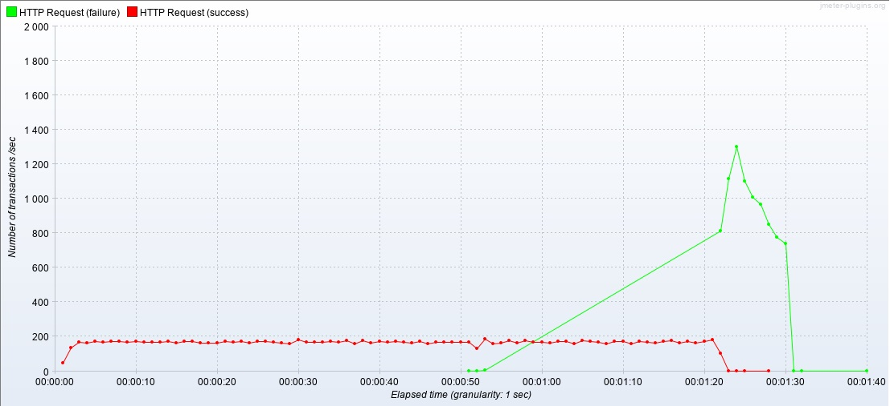
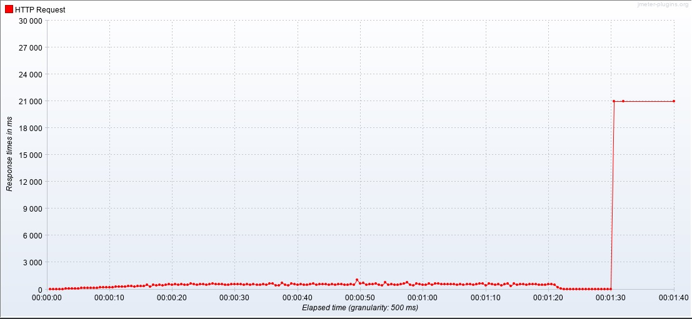
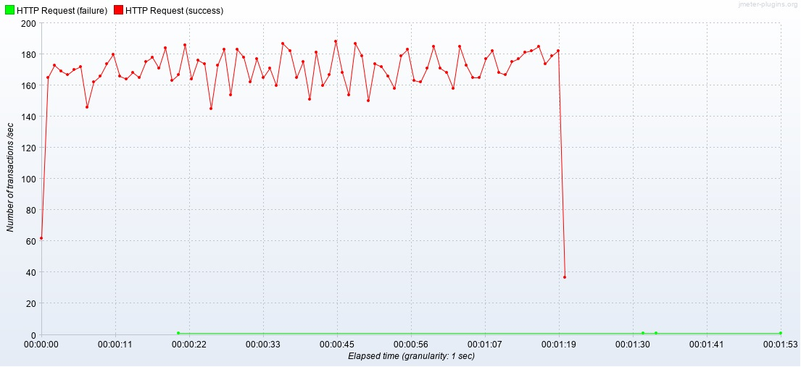
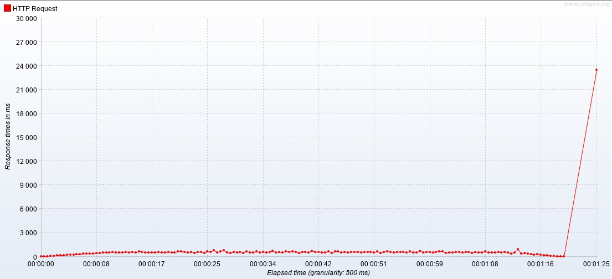
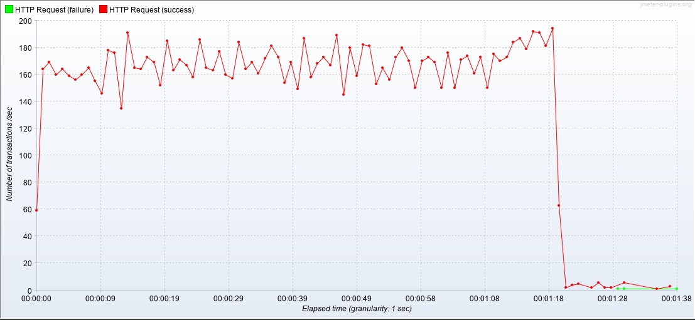
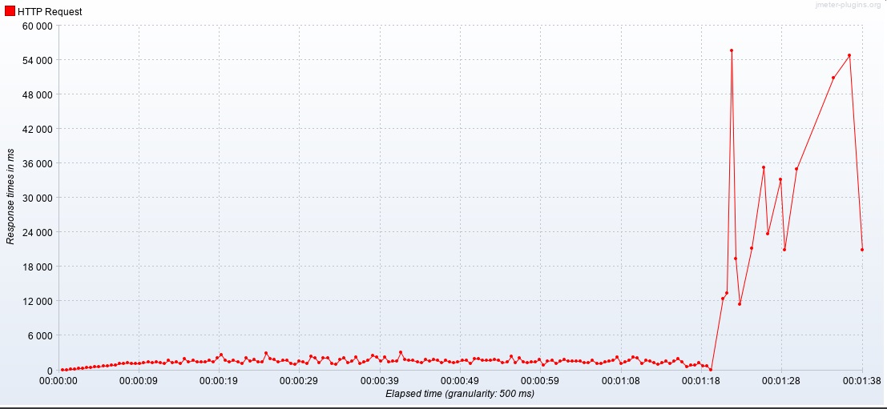
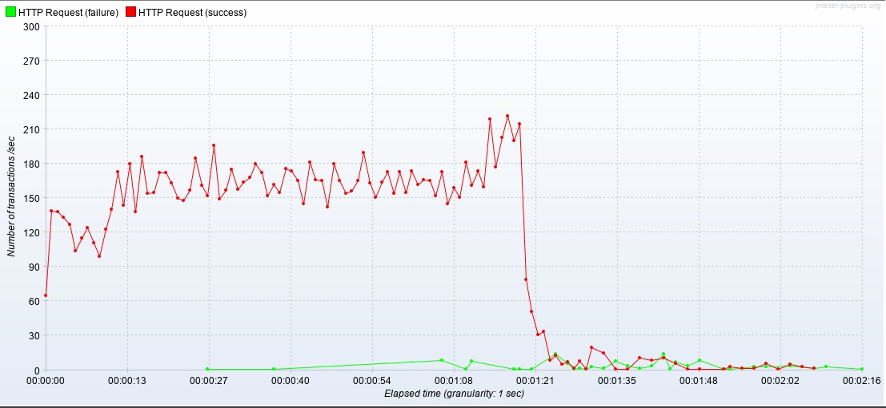
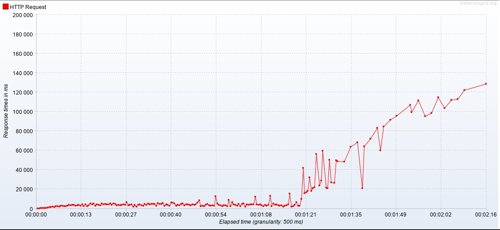

# 성능테스트

### 종류

1. 부하테스트
   - 목표 성능 도달 여부를 측정
   - 성능 목표치는 요구사항에서 주어지고 이를 도달하지 못하면 도달을 위한 개선작업을 해야한다.
2. 스파이크 테스트
   - 일시에 부하가 몰릴 때 시스템이 버틸 수 있는지 체크한다.
   - 한계성능을 체크한다.
3. 신뢰성 테스트
   - 한계 부하가 걸린 상태에서 시스템의 모든 기능들이 어느 정도 정상 운용되는지 테스트한다. 이 결과는 SW 품질 특성 중 '신뢰성'을 나타내는 지표로 활용된다.

### 수행 흐름

1. 사용자 프로파일 분석
2. 수행할 성능 테스트 종류 결정
3. 시스템 구조 분석
4. 시나리오 준비
5. 테스트 수행
6. 결과 분석


### 테스트 도구

| 상용                                                 | 오픈소스                             |
| ---------------------------------------------------- | ------------------------------------ |
| Load Runner (Micro Focus), Load UI Pro(SmartBear) 등 | Jmeter, nGrinder, Gatling, Locust 등 |


### 부하 테스트

#### 측정 도구

- jmeter

#### 테스트 종류

- 부하 테스트

#### 대상

- Tripdiary Back-end Login API

#### 결과물

##### 시나리오 1

- Users : 100
- Startup Time: 20 sec
- Hold Load For:  60sec
- Shutdown Time: 10 sec
- 결과

| Label        | # samples | Average | Min  | Max   | Std.Dev.       | Error %            | Throughput         | Received KB/sec    | Sent KB/sec        | Avg.Bytes          |
| ------------ | --------- | ------- | ---- | ----- | -------------- | ------------------ | ------------------ | ------------------ | ------------------ | ------------------ |
| HTTP Request | 21054     | 358     | 1    | 49275 | 644.7671914637 | 0.3389379690320129 | 207.08784561362094 | 259.87981519937637 | 31.417001245487718 | 1285.0436971596846 |
| TOTAL        | 21054     | 358     | 1    | 49275 | 644.7671914637 | 0.3389379690320129 | 207.08784561362094 | 259.87981519937637 | 31.417001245487718 | 1285.0436971596846 |

- TPS(Transaction per Second)

  

- 응답시간

  

잘 되다가 마지막에 error 가 난다.

에러는 

```
Response code:Non HTTP response code: java.net.BindException
Response message:Non HTTP response message: Address already in use: connect
```

라고 뜨는데 서버가 요청을 감당하지 못한다고 생각했다.

정확한 원인을 찾으려 구글에 검색해 보았다.

- 구글에 많은 사람들이 Window에서 이런 문제가 발생한다고 적어놨었고 이유는 TCPIP의 MaxUserPort 값이 작게 설정되어있어서 나타나는 문제라고 하고 있었다.  resistry 편집기를 이용해

```
HEKEY_LOCAL_MACHINE
 - SYSTEM
 	- CurrentControlSet
 		- Service
 			- Tcpip
 				- Parameters
```

​	경로에 있는 MaxUserPort의 값을 기존 15000에서 65534 로 바꿔주었지만 결과는 변함이 	없었다.

- **로컬환경**에서 같은 서버를 작동시켜보았다. Https 대신 http를 사용했다. TPS가 절반정도(80~90)로 낮아졌고 응답시간이 조금 길어졌지만 위의 **에러는 발생하지 않았다**. 하지만 여전히 어떤 것이 원인인지 파악하지 못했다.

- MySQL connection pool Limit에 문제가 있다고 생각해서 Connection Limit을 높여 보았다. RDS에서 확인 해보니 Connection은 올라갔지만 여전히 결과는 같았다.

- 요청에 비해 서버 프로그램의 능력이 부족한 것인가 싶어서 PM2를 이용해 멀티 프로세싱을 해보았지만 결과는 같았다. 단일 프로세스일 때, cluster 모드로 process 2개를 돌렸을 때, 4개를 동시에 돌렸을 때, TPS와 response time은 거의 비슷했고 여전히 같은 에러가 출력되었다.

- 윈도우 말고 리눅스 서버의 Port와 Socket max connection이 부족할 수도 있겠다 싶어서

  ```shell
  sudo sysctl net.ipv4.ip_local_port_range="15000 61000"
  sudo sysctl net.core.somaxconn=1024
  ```

  위와 같이 설정해 보았지만 결과는 같았다.

- 백엔드 프로그램이 Nginx를 거치지 않고 호스팅 되기 때문에 불안정해서 에러가 발생하는가 싶어서 root/api 로 들어오는 요청을 백엔드 포트로 Proxy_pass 해주는 방식으로 Nginx를 거치게 만들고 req_limit을 많이 늘려봤지만 TPS와 응답시간 에러 모두 같은 결과였다.

- 에러가 뜨는 상황에서 다른 요청을 보내보는 실험을 했다. 

  ```shell
  tail -f /var/log/nginx/access.log
  ```

  명령어를 이용해서 nginx가 처리하는 요청과 응답들을 모니터링했다.

  에러가 나는 시간에 브라우저를 이용해 서버에 요청을 보냈을 때는 Niginx에 반응이 없었고 브라우저 콘솔에 net::ERR_ADDRESS_IN_USE 라는 에러 메세지가 동일하게 나왔다. 이 때 서버가 죽은줄 알았다. 하지만 동일한 조건에서 API Tester를 이용한 요청은 서버가 바로 처리하는 것을 볼 수 있었다. 즉, 서버가 죽지 않았다는 것을 알았다. 내 컴퓨터의 네트워크가 이 에러의 원인일 확률이 높다고 생각했다.

- 그래서 에러가 나는 시간대에 네이버에 접속해 보았다. 그런데 예상과 다르게 문제없이 잘 작동했다. 그리고 다시 에러가 나는 시점에 내 브라우저로 요청을 보냈는데 net::ERR_ADDRESS_IN_USE  에러 없이 잘 작동했다.. 뭐지..

-  도대체 무슨 상황인지 알 수가 없다.

혹시 다른 값을 바꾸면 어떻게 될까 싶어 유저수는 유지하고 Startup Time을 10초로 바꿔주고 실험해 보았다.

##### 시나리오 2

- Users : 100

- Startup Time: 10 sec

- Hold Load For:  60sec

- Shutdown Time: 10 sec

- 결과

  | Label        | # samples- | Average | Min  | Max   | Std.Dev.          | Error %               | Throughput        | Received KB/sec  | Sent KB/sec       | Avg.Bytes         |
  | ------------ | ---------- | ------- | ---- | ----- | ----------------- | --------------------- | ----------------- | ---------------- | ----------------- | ----------------- |
  | HTTP Request | 13742      | 511     | 34   | 23525 | 602.1028852229458 | 2.1830883423082522E-4 | 161.5052828281641 | 91.8748856868558 | 37.05610920660618 | 582.5189200989666 |
  | TOTAL        | 13742      | 511     | 34   | 23525 | 602.1028852229458 | 2.1830883423082522E-4 | 161.5052828281641 | 91.8748856868558 | 37.05610920660618 | 582.5189200989666 |

- TPS(Transaction Per Second)

  

  TPS가 170사이를 왓다갔다 하면서 유지되었다.

유저수는 변하지 않았지만 이전과 다르게 서버가 죽지 않았다. 에러가 몇개 없었고 전체 에러는 0.02%였다.  평균 응답시간이 늘어난 것은 마지막에는 그래프가 위로 튀었기 때문이다.

- 응답시간

  

Startup Time을 줄인것은 유저가 유입되는 속도를 빠르게 한 것인데 왜 결과가 좋아졌는지는 모르겠다.

유저를 더 늘려보기로 했다.

##### 시나리오 3

- Users : 300

- Startup Time: 10 sec

- Hold Load For:  60sec

- Shutdown Time: 10 sec

- 결과

  | Label        | # samples- | Average | Min  | Max   | Std.Dev.           | Error %              | Throughput        | Received KB/sec   | Sent KB/sec        | Avg.Bytes         |
  | ------------ | ---------- | ------- | ---- | ----- | ------------------ | -------------------- | ----------------- | ----------------- | ------------------ | ----------------- |
  | HTTP Request | 13680      | 1583    | 36   | 55787 | 2935.9424932155207 | 2.192982456140351E-4 | 139.1276048287856 | 79.14530207559979 | 31.921696466255455 | 582.5212719298246 |
  | TOTAL        | 13680      | 1583    | 36   | 55787 | 2935.9424932155207 | 2.192982456140351E-4 | 139.1276048287856 | 79.14530207559979 | 31.921696466255455 | 582.5212719298246 |

  전체 에러는 0.022% 정도였는데 마지막 부분에 집중되어있었다.

- TPS(Transaction Per Second)

  

  TPS는 계속해서 170을 왔다갔다 했고 마지막에 에러가 많이 발생했다.

- 응답시간

  

  특히 마지막 부분에 응답시간이 매우 길었는데 응답이 끝나지 않았을 때 웹페이지를 사용하는 다른 요청을 보내보니 그 요청이 먼저 처리되었다. 


##### 시나리오 4

- Users : 1000

- Startup Time: 10 sec

- Hold Load For:  60sec

- Shutdown Time: 10 sec

- 결과

  | Label        | # samples- | Average | Min  | Max    | Std.Dev.           | Error %              | Throughput        | Received KB/sec   | Sent KB/sec        | Avg.Bytes         |
  | ------------ | ---------- | ------- | ---- | ------ | ------------------ | -------------------- | ----------------- | ----------------- | ------------------ | ----------------- |
  | HTTP Request | 13468      | 5557    | 44   | 128940 | 12009.417780234306 | 0.009355509355509356 | 99.01339489200276 | 58.38627839154696 | 22.510217212105395 | 603.8329373329374 |
  | TOTAL        | 13468      | 5557    | 44   | 128940 | 12009.417780234306 | 0.009355509355509356 | 99.01339489200276 | 58.38627839154696 | 22.510217212105395 | 603.8329373329374 |

  에러가 0.9 % 까지 높아졌고 48명의 사용자가 빠져나가지 못했다. 시스템에 큰 부하가 걸린 것 같다.

- TPS(Transaction Per Second)

  

- 응답시간

  


결국 이런저런 시도를 해봤지만 에러의 원인을 찾지 못했고 시스템 개선도 하지 못했다.


