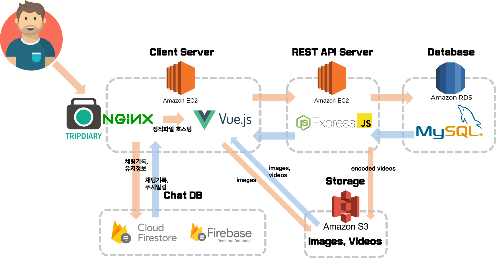
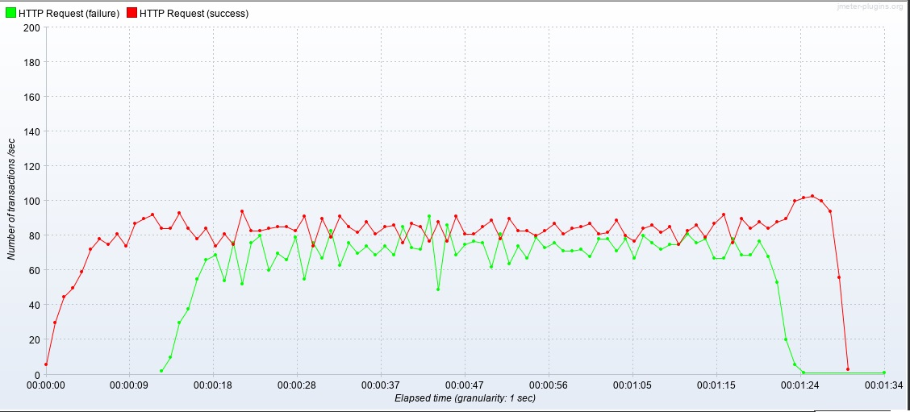
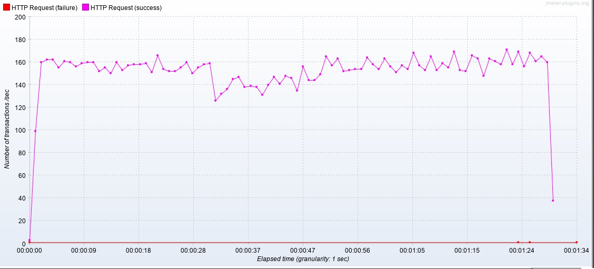

# 웹 어플리케이션 성능 향상을 위한 캐시 적용

### 캐시란?

### 시스템 아키텍처



시스템의 부하가 많이 걸리는 구간은 video를 인코딩하여 S3에 저장하는 구간과 DB server와 요청을 주고받는 구간, Chat DB와 통신하는 구간일 것이라고 생각했다.

그 중 DB와 소통하는 구간은 Redis를 사용하여 cache할 수 있으므로 적용해 보기로 하였다. 모든유저 공통으로 데이터를 받아와야 되는 메인페이지인 GET api/posts/:page 요청을 cache하기로 했다.

### 캐시적용 공통 프로젝트 소스

##### linux 환경에 redis-server 설치하기

```shell
$ sudo apt-get install redis-server
```

##### 설치후 잘 작동하는지 확인

```shell
$ ps -ef | grep redis
redis     1747     1  0 10:21 ?        00:00:00 /usr/bin/redis-server 127.0.0.1:6379
ubuntu    1871 30639  0 10:23 pts/0    00:00:00 grep --color=auto redis
$ redis-cli
127.0.0.1:6379> ping
PONG
127.0.0.1:6379> exit
```

- 잘 작동한다.

##### GET posts/:page 요청에 cache 달아서 사용하기

```typescript
// index.ts
...
import * as redis from 'redis';
import * as util from 'util';
...

const client = redis.createClient(6379, '127.0.0.1');
const getAsync = util.promisify(client.get).bind(client);
const setAsync = util.promisify(client.set).bind(client);
...

export { getAsync, setAsync, client };
```

- client를 싱글톤으로 사용하기위해 index.ts 에서 export 시켜주었다. async await 패턴을 client.get(), client.set() 함수에 적용하기위해 util.promisify()를 이용해 async function 처럼 바꿔주고 export 시켰다.

```typescript
// PostController.ts
...
import { clinet } from '../../index.ts';
import * as util from 'util';
...

@Get("/posts/:page")
async getPost(@Param("page") page: number) {
    let result = await getAsync(`post${page.toString()}`);
    if (result == null) {
        const posts = await this.postService.findByPage(page, getConnection())
        await setAsync(`post${page.toString()}`, JSON.stringify(posts));
        expire(page.toString(), 20);
        result = await getAsync(`post${page.toString()}`);
    }
    return JSON.parse(result);
}
```

- index.ts 에서 client, getAsync, setAsync를 import해 사용했다.

### Jmeter를 활용한 캐시 적용 서비스 성능 비교

#### 테스트 조건

- Start Threads Count : 100
- Startup Time: 20 sec
- Hold Load For: 60 sec
- Shutdown Time: 10 sec
- target: GET /api/posts/1

#### redis 적용 전

##### Summary Report

| Label        | # Samples | Average | Min  | Max   | Std. Dev. | Error % | Throughput | Received KB/sec | Sent KB/sec | Avg. Bytes |
| ------------ | --------- | ------- | ---- | ----- | --------- | ------- | ---------- | --------------- | ----------- | ---------- |
| HTTP Request | 12189     | 617     | 44   | 21004 | 486.7     | 39.67%  | 129.9412   | 757.21          | 50.62       | 5967.2     |
| TOTAL        | 12189     | 617     | 44   | 21004 | 486.7     | 39.67%  | 129.9412   | 757.21          | 50.62       | 5967.2     |

- 에러가 39.67%로 높았는데 connection limit이 초과 되었다는 에러가 대부분이었다. AWS RDS의 제일 저렴한 인스턴스인 t2를 사용하고 있는데 t2의 connection limit은 66으로 설정되어있기 때문이다.

  이 부분은 Redis를 적용하면 개선될 것으로 기대했다. 저장하고 있는 데이터에 대해서는 DB와 connection을 만들지 않고 가져올 것이기 때문이다.

##### Response Times over Time


##### TPS



#### Redis 적용 후

##### Summary Report

| Label        | # Samples | Average | Min  | Max   | Std. Dev. | Error % | Throughput | Received KB/sec | Sent KB/sec | Avg. Bytes |
| ------------ | --------- | ------- | ---- | ----- | --------- | ------- | ---------- | --------------- | ----------- | ---------- |
| HTTP Request | 13768     | 547     | 33   | 21003 | 690.54    | 0.03%   | 146.8618   | 1173.8          | 57.21       | 8184.3     |
| TOTAL        | 13768     | 547     | 33   | 21003 | 690.54    | 0.03%   | 146.8618   | 1173.8          | 57.21       | 8184.3     |

- 에러가 눈에 띄게 줄었고 평균응답시간도 약간의 개선이 있었다.

##### Response Times over Time


##### TPS



#### 결과 비교

- Redis 적용 후 error가 눈에 띄게 줄었다. connection을 하나만 사용했기 때문이다.
- TPS도 90 언저리에서 160 언저리로 약 80% 상승했다. 
- Response time이 전체적으로 조금 개선되었지만 마지막에 급격하게 증가하는 문제는 똑같았다.