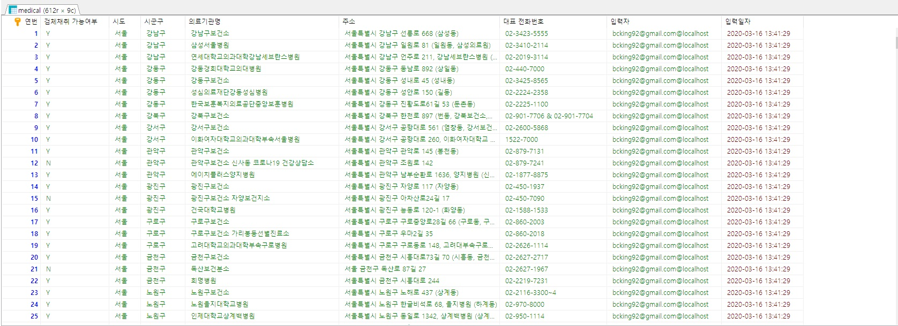

# DB 데이터 적재 및 가공

- 사용 DB 
  - MariaDB

### 도로명 데이터 적재

- table 생성

  ```mariadb
  CREATE TABLE addr (
  도로명코드 VARCHAR(255) NOT NULL,
  도로명 VARCHAR(255) NOT NULL,
  읍면동일련번호 VARCHAR(255) NOT NULL,
  시도명  VARCHAR(255) NOT NULL,
  입력자 VARCHAR(255) NOT NULL DEFAULT CURRENT_USER,
  입력일자 TIMESTAMP NOT NULL DEFAULT CURRENT_TIMESTAMP,
  PRIMARY KEY (도로명코드, 읍면동일련번호)
  ) CHARACTER SET `utf8`;
  ```

  입력자, 입력일자 column 생성

- 도로명 데이터 전처리

  1. 다른이름으로 저장 -> 인코딩 UTF-8

- DB 적재

  ```mariadb
  LOAD DATA INFILE 'c:/codes/self-online/day06/addr/addr2.txt'
  INTO TABLE addr
  CHARACTER SET utf8
  FIELDS TERMINATED BY '|'
  ENCLOSED BY '"'
  LINES TERMINATED BY '\n'
  (@col1, @col2, @col3, @col4, @col5, @col6, @col7, @col8, @col9, @col10, @col11, @col12, @col13, @col14, @col15, @col16, @col17) SET 도로명코드=@col1, 도로명=@col2, 읍면동일련번호=@col4, 시도명=@col5;
  ```

  활용 가이드를 참고하여 필요한 컬럼만 사용

- 서울이 아닌 데이터 삭제

  ```mariadb
  DELETE FROM addr WHERE 시도명 != '서울특별시';
  ```

- 결과

  ```mariadb
  SELECT * FROM addr;
  ```

  

- csv파일 내보내기

  ```mariadb
  SELECT * 
  INTO OUTFILE 'C:/CODES/self-online/day06/addr.txt'
  CHARACTER SET utf8
  FIELDS 
  ENCLOSED BY '"'
  TERMINATED BY ','
  ESCAPED BY '"'
  LINES TERMINATED BY '\n'
  FROM addr;
  ```

  ### [도로명주소 csv](addr.txt)

### 선별진료소 데이터 적재

- table 생성

  ```mariadb
  CREATE TABLE medical (
  연번 INT NOT NULL AUTO_INCREMENT,
  `검체채취 가능여부` VARCHAR(10) NOT NULL,
  시도 VARCHAR(255) NOT NULL,
  시군구 VARCHAR(255) NOT NULL,
  의료기관명 VARCHAR(255) NOT NULL,
  주소 VARCHAR(255) NOT NULL,
  `대표 전화번호` VARCHAR(255) NOT NULL,
  입력자 VARCHAR(255) NOT NULL DEFAULT CURRENT_USER,
  입력일자 TIMESTAMP NOT NULL DEFAULT CURRENT_TIMESTAMP,
  PRIMARY KEY (연번)
  ) CHARACTER SET `utf8`;
  ```

  입력자, 입력일자 column 생성

- 진료소 데이터 전처리

  1. 전화번호에 `,`가 들어가는 부분을 &기호로 바꿔주기
  2. UTF8 txt 파일로 저장

- DB 적재

  ```mariadb
  LOAD DATA INFILE 'c:/codes/self-online/day06/download/medical3.txt'
  INTO TABLE medical
  CHARACTER SET utf8
  FIELDS TERMINATED BY ','
  ENCLOSED BY '"'
  LINES TERMINATED BY '\n'
  IGNORE 1 ROWS
  (`연번`, `검체채취 가능여부`, `시도`, `시군구`, `의료기관명`, `주소`, `대표 전화번호`);
  ```

  모든 컬럼 다 사용. 첫 째 행은 컬럼명이르모 IGRNORE 1ROWS 추가

- 서울이 아닌 데이터 삭제

  ```mariadb
  DELETE FROM medical
  WHERE 시도!='서울';
  ```

- 결과

  

- csv 파일 내보내기

  ```mariadb
  SELECT * 
  INTO OUTFILE 'C:/CODES/self-online/day06/medical.txt'
  CHARACTER SET utf8
  FIELDS 
  ENCLOSED BY '"'
  TERMINATED BY ','
  ESCAPED BY '"'
  LINES TERMINATED BY '\n'
  FROM medical;
  ```

  ### [선별진료소 csv](medical.txt)

