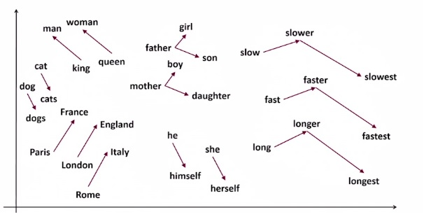
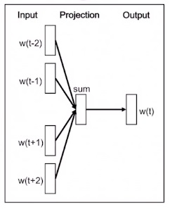
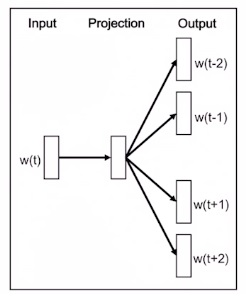
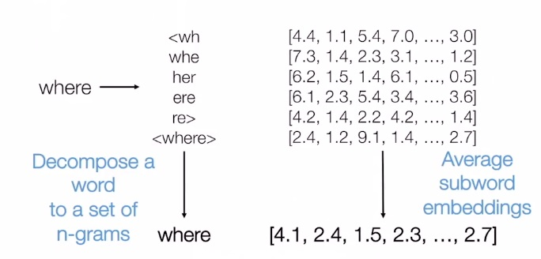

# 인공지능

### Machine Learning VS Big Data ?

- Machine Learning is one way yo analyze, understand, and predict Big Data
- 빅데이터를 해석하고 분석하는 방법론 중 하나가 머신러닝이다.

### Machine Learning VS Data Mining?

- Data Mining은 대부분 structured data를 다루지만 Machie Learning 은 대부분 비정형 Data를 다룬다.

### Machine Learning VS AI(Artificial Intellegence)?

- Machine Learning develops data-dependent solutions to the problems in Artificial Intelligence 

### Machine Learning VS Statistics?

- Machine Learning is deeply rooted in, but expands the practical limitations of Statistics

### Major Problem Formulations in ML

- Supervised Learning
- Unsupervised Learning
- Reinforcement Learning, *not Covered today*
- (Representation Learning), Deep Learning의 영역

### Supervised Learning(지도학습)

- Label(정답)이 붙어있는 Training Data를 통해 학습
- 학습된 결과를 바탕으로 Label이 없는 test 데이터를 **classification** 한다.

#### Classification Model

- 비선형 모델(Non-Linear Model)
  - Desision Trees(결정 트리)
- 선형 모델(Linear Model)
  - Linear Regression(선형 회귀)

### Unsupervised Learing(비지도학습)

- Label이 없는 Training Data를 통해 학습
- 여러 데이터중 비슷한 것을 찾아라

#### K-means clustering

#### DB Scan

### Representation Learning

- Deep Neural network

#### Neural Network?

#### Why Neural Network is rising now?

- Complexity of model is very high 
  - requires huge datasets, advanced hardware with fast processors, large memory, high I/O speed
  - 모델이 복잡하다 -> 정교하지만 많은 데이터와 높은 성능이 요구된다.
  - 데이터양, 컴퓨터의 성능이 늘어나면서 급부상.
- Model is prone to overfiiting
  - advanced algorithms to overcom overfitting are needed
  - overfitting 은 전체중에 작은 부분에 의해 결과를 결정해버리는 것.
- Parameter estimation is difficult

### Major Domain within AI & Data set

- Visual Intelligence(Computer Vision, Machine Vision)
  - MNIST Dataset
  - ImageNet
- Language Intelligence
  - Q&A
  - Machine Translation

### Linear Regression(선형 회귀)

- Regression중 가장 간단한 방법
- 결과값이 실수로 나온다.
- ex) 가격 예측, 소비자의 지출 예상, 

#### 수식

##### Linear Regression

- Response (real number) is a linear function of the inputs

  ### 

  의 기울기를 가지고 의 절편을 가진다.

- Assume that  (the residual error) has a Gaussian distribution

  

- where

  

##### Modeling non-linear relationships

- Simply Take

  

- and replace $x$ with some non-linear function of the inputs

  	ex) 

  this is called the basis function expansion.

  이 경우에도 여전히 Linear Regression 이라고 불린다. 왜냐하면 Parameter 에 대해 선형이기 때문이다.  라는 의미.

- Polynomial Regression

  

- Multivariate linear regression

  

##### Maximum likelihood estimation(MLE)

- Using MLE, arguments   can be computed by

  $arg\space max\space  log p(D|\theta) = \sideset{}{_{i=1}^Nlogp(y_i|x_i, \theta)}\sum$

- if we plug in the Gaussian formulation

  

  and put it into the log likelihood above, we get

  $=\sideset{}{_{i=1}^Nlog[(\frac{1}{2\pi\sigma^2})^\frac{1}{2}exp(-\frac{1}{2\sigma^2}(y_i - w^Tx_i)^2)]}\sum$

  $= -\frac{N}{2}log(2\pi\sigma^2) - \frac{1}{2\sigma^2}\sideset{}{_{i=1}^N}\sum(y_i - w^Tx_i)^2$

  and **Negative log likelihood (NLL)** is

  $ \frac{N}{2}log(2\pi\sigma^2) +\frac{1}{2\sigma^2}\sideset{}{_{i=1}^N}\sum(y_i - w^Tx_i)^2$

- To **minimize NLL**, we minimize this term

  $\sideset{}{_{i=1}^N}\sum(y_i - w^Tx_i)^2$

  called **residual sum of squares(RSS)**

- RSS를 통해 NLL을 최소화 하는 것이 가장 최적화된 regression이 된다.

##### Ridge Regression

- MLE can overfit

  - For linear regression, this means the weight can become large

  - We can encourage the weights to be small by putting a zero-mean Gaussian prior on the weights

     **Regularization**(를 이용하는 Regularzation)

- Zero-mean Gaussian prior on the weights

  $p(w) = \sideset{}{_j  N(w_j|0, \tau^2)}\prod$

- MAP estimation problem

  $argmax \sideset{}{_{i=1}^Nlog(y_i|w_0 +w^Tx_i, \sigma^2)}\sum + \sideset{}{j_i^D logN(w_j|0, \tau^2)}\sum$

- Compare with the MLE problem

  $arg\space max\space log\space p(D|\theta) = \sideset{}{_{i=1}^N (y_i - (w_0 + w^Tx_i))^2 + \lambda||w||_2^2}\sum$

  $J(w) = \frac{1}{N}\sideset{}{_{i=1}^N (y_i-(w_0+w^Tx_i))^2 + \lambda||w||_2^2}\sum$

- Compare with NLL Before

  $\sideset{}{_{i=1}^N}\sum(y_i - w^Tx_i)^2$

- So the first term of ridge regression is same as NLL, and the second term is the complexity penalty (when $\lambda$ 0)

- Corresponding solution is

  $\hat{w}_{ridge} = (\lambda I_D + X^TX)^{-1}X^Ty$

  $\hat{w}_{OLS} = (X^TX)^{-1}X^Ty$

- Regularization effects of big data
  - 데이터가 많아질 수록 Regularization 효과를 볼 수있다.
  -  = 그래프가 부드러워짐

#### Regression 모델 평가하기

- test case와 past case의 오차 정도를 본다.
  - 둘다 너무 오차가 크다.
    - 모델 설계가 잘못
  - n이 작을 때 past case에 대해 오차가 적고 test case에 대해 약간의 오차를 보인다. n이 커질 수록 개선된다.
    - 설계 잘했다
  - n이 작을때 past case에 대해 오차가 거의없고 test case에 대해 큰 오차를 보인다. n이 커질수록 개선되지만 그래프가 가파르다.
    - Overfitting 이다.
    - = 불필요하게 complex
    - 하지만 n이 커지면 어느정도 유효한 모델이다.
  - n이 적당히 커졌음에도 past case에 대해서만 오차가적고 test case에 대해 오차가 크다.
    - 심하게 Overfitting 되어서 유효하지 않은 모델이다.

### Naive Bayes Classifier

- 기본이 되는 모형이다.
- 분류 결과가 좋진 않지만 연구에서 기준이 되는 모형. 
  ex) 나이브 베이즈 해봣더니 60%이더라 이것보단 좋아야된다. 이런식

#### Feature

- We use "feature" to simplify the classification and clustering problems
- Features turn objects (images, documents, etc) into a set of numbers so that we can do computation over them
- What features can we use for the image classification? For spam email classification?
- 데이터의 성질, detail을 말한다.

##### Problems

- Digit Recognition

  - input: pixel grids

    - int\[2]\[8]\[8]

  - output: a digit 0-9

  - **Naive Bayes model**

    -  Y 숫자일 확률, prior probability 라고 한다.

      - Prior Probability는 Uniform을 따르지 않을 수도 있다. 
        ex) 전화번호 맨앞자리는 0일 확률이 높음

    -  pixel (i,j)이 색칠 되어있다.

    -  숫자가 Y일 때 pixel(i,j)가 칠해질 확률

    - $P(Y|F_{0,0} ...F_{15,15}) \propto P(Y)\sideset{}{_{i,j} P(F_{i,j}|Y)}\prod)$

    - 그렇다면 를 어떻게 찾아내냐?

      - 이걸 찾아내는 과정이 Naive Bayes model을 학습하는 과정이다.

      - Training data를 많이 때려넣는다.

      - Y를 그린 천번의 데이터 중 가 색칠되어 있는 경우는 얼마나 되느냐?(Emprical)

        

        또는, 전문가에게 물어볼 수 도 있다. (xray에서 이부분이 이럴때 이 병일 확률이 얼마나될까요? 의사에게 물어보는)

    - Overfitting?

      - test data 구석에 점이 찍혀있으면 확률이 0이 되므로 total P 도 0이될 수 있다.

      - Smoothing estimate를 해야된다. 어떻게? 모든 데이터에 + 1을 해준다.

        

        더 일반적으론 k를 더해준다.

        

        이러한 smoothing을 Laplace smoothing이라고 한다.

        이 때, k 같은 parameter를 hyper parameter라고 한다. regulation에서의 도 마찬가지.

    - Tuning on Held-Out Data

      - Held-out data = validation data
      - 일반적으로 1000개의 데이터가 있으면 800은 training, 100은 validation, 100은 test용으로 사용한다.

- Email spam filtering

  - **Naive Bayes model**
    -  메일 C가 스팸일 확률
    - 단어 i가 있다.
    - C가 스팸이었는데 단어 $W_i$가 포함되어있을 확률

How would you do this?

#### Simple Classification

- Simple example: two binary features

   <- direct estimate

   <- Bayes estimate(no assumptions)

   <- Conditional independence

#### Baselines

- model 학습의 기준이되는 

- 대부분의 경우 NB(Naive Baise)가 Baseline이 되는데 다른것들을 사용할 수도 있다.

- ex) most frequent label classifier

  label중 60%가 dog이라면 60%가 dog의 baseline이 된다.

- ex) 가장 최근에 나온 모델을 baseline으로 사용할 수도 있다.

#### What to do about Errors?

- 에러가 많이 나올 경우 다른 feature가 더 없는지 찾아 봐야 한다.

  - 일반적으로 homogeneous한 feature들이 좋음

    ex. 모든 feature가 word인 경우, 모든 feature가 숫자인 경우

#### Feature

- Naive Bayes

  - random variable & each value has conditional prob. given the label.

- Most Classifiers

  - features are real-valued fucntions

- Common special cases

  - Indicator features take values 0 and 1 or -1 and 1
  - Count feature return non-negative integers (Back of words 3, 5)

- Feature를 생성하기 위해 computation이 필요할 수도 있고 computation에 많은 cost가 있을 수 있다.

- Feature를 생성하기 위해 심지어 다른 classfier 나 model이 사용 될 수도 있다.

- Feature를 결정하는 것은 domain knowledge(전문지식)를 필요로한다.

  ex. 어떤 feature가 큰 영향을 주는지는 전문가의 지식을 필요로 함

### Deep Natural Language Processing(NLP)

- 단어, 문장, 문서에서 의미를 찾아내는 것이 NLP의 궁극적인 목표

#### Word, Sentence, and Document Embedding

##### Word Vector Representation : "Word Embedding"

- Assign meaningful numbers to a word, in order to user them as inputs for NLP systems

- Continuos(dense) Vector Representations

  $where$					

  하나의 단어를 실수 여러개의 vector로 표현한다.

  embedding field(word vector가 존재하는 공간) 위의 vector 값들이 서로 비슷한 공간에 위치하면서 연관성을 부여한다.

  

- One-hot Vector Representations

  $where$					

  단어들사이의 relation을 catch할 수 없다.

  ex. Hi, Hello 는 비슷한데 다른 단어로 conut한다.

##### Distributed Representations

- many-to-many relationship (such as concepts-neurons) between two types of representations

  - Each neuron represent something

  - Many-to-many relationship:

    - a concept - many neurons

    - a neuron - many concepts(word)

      | word(concepts)\|neuron | neuron1 | neuron2 | neuron3 | neuron4 | ...  |
      | ---------------------- | ------- | ------- | ------- | ------- | ---- |
      | dog                    | 1       | 3       | 2       | 4       | ...  |
      | cat                    | 4       | 6       | 3       | 1       | ...  |
      | human                  | 5       | 9       | 8       | 2       | ...  |
      | ...                    | ...     | ...     | ...     | ...     |      |

      이런식이다.

- Distributed Representations of Words

  - Semantic and syntactic characteristics are represented as activation of hidden neurons

##### Distributional Hypothesis

- Words that occurs in the same contexts tent to have similar meanings
- 문맥이 비슷하면 의미도 비슷할 것이다. 라는 가정.
- distributed representations은 이 가정을 바탕으로 하고 있다.

##### Word2Vec

- Distributed Representation of Words and Phrases and their Compositionality

- **CBOW**

  

  - 문맥에 있는 단어를 안다. 중간에 있는 단어가 무엇일까? fliction

- **Skip-Gram**

  

  - 중간에 있는 단어를 안다. 문맥의 양 옆에 있는 단어는 무엇일까?

- Evaluation: **Word Similar Task**

  - Efficient Estimation of Word Representations in Vector Space
  - 사람이 매긴 유사도 Evaluation과 비교해 봄.

- Evaluation: **Word Analogy Task**

  - 
    - Given and , compute and evaluate cosine distance from 
    - 잘 학습되었다면  이어야 한다.

- Problem of word-level approach

  - Out-of-vocabularies: Unseen words
    - Morphologically rich languages
    - Compositioinality of words
  - Quality of vectors assigned to rare words
  - Segmentation issues

##### Subword-information-skip-gram

- 단어를 잘라서 모델링을 한다. 한글로 치면 예쁨 -> ㅇ, ㅖ, ㅃ, ㅡ ㅁ 을 나눠서 조합
- 이렇게 하면 학습이 더 잘됨..

 

Word Embedding의 문제는 context가 없다는 것이다. 그래서 나온것이 바로!

##### Contextualized Word Embedding

- Nueral net기반 ELMo
  - 방향성이 한방향

##### "Transfomers" as a Bidirectional Language Model

- self-attention을 사용

  ex. eat이랑 apple이 나오면 연관이있다 라는 걸 미리 학습해놓고 문장내에서 연관을 짓는다.

- Bidirectional Encoder Representations from Transformers (BERT)

  - 양방향으로 다 연관을 짓자